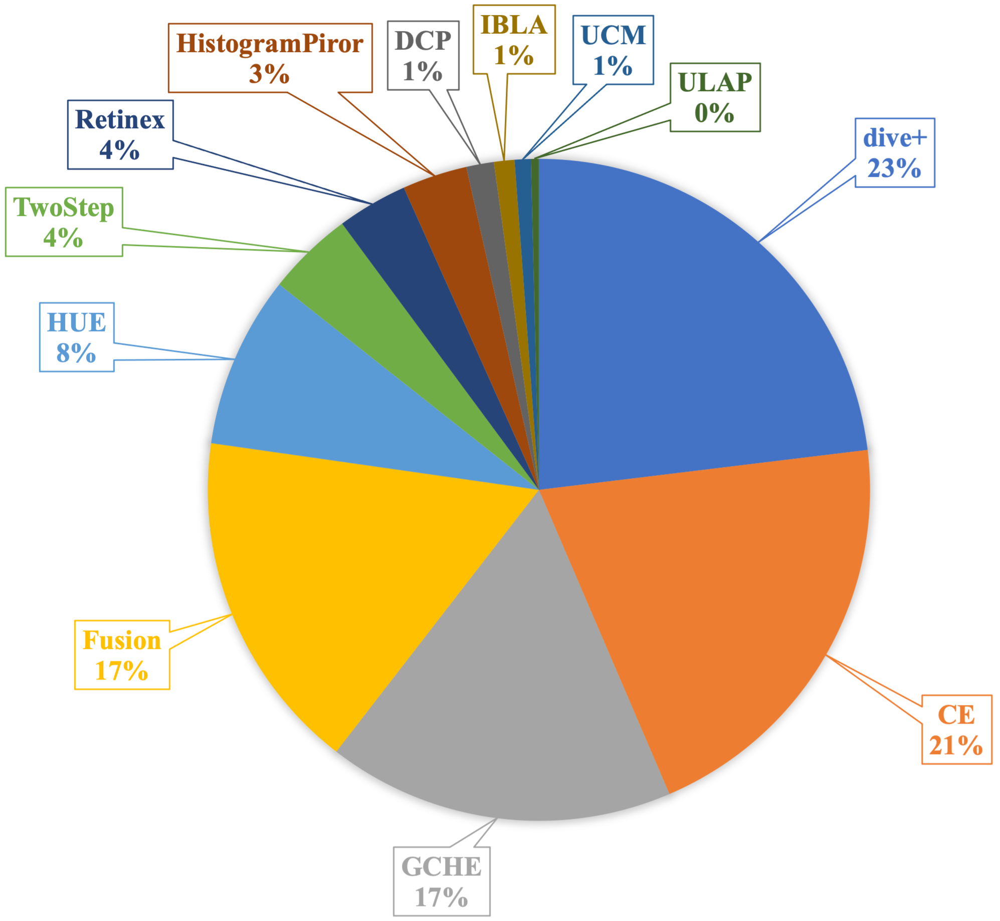
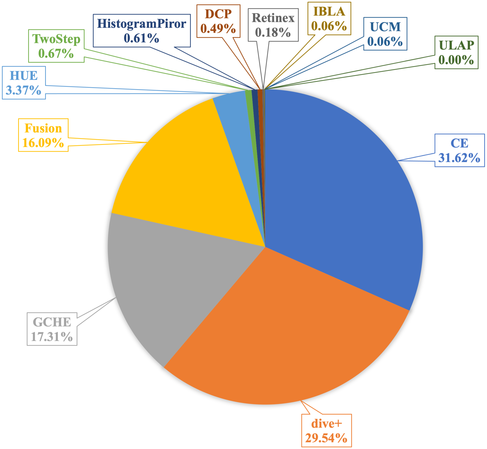

# SUIM-E
The SUIM-E dataset is created by supplementing the [SUIM](https://github.com/xahidbuffon/SUIM) dataset with the corresponding enhancement references.

We used 12 underwater image enhancement methods to generate candidate reference images, including CE[1], Fusion [2], GCHE [3], HistogramPiror [4], HUE [5], IBLA [6], Retinex [7], TwoStep [8], UCM [9], ULAP[10]), DCP [11] and a commercial application for enhancing underwater images (i.e., dive+ [12] ). During the whole voting phase on SUIM dataset, the distribution of votes received by different underwater enhancement methods and the percentages of the reference images from the results of different methods are shown below.

<table><tr>
<td></td>
<td></td>
</tr>
<tr>
<td align="center">The percentages of votes received by different underwater enhancement methods in the vote on the whole dataset.</td>
<td align="center">The percentages of the reference images from the results of different methods.</td>
</tr>
</table>

The SUIM-E dataset contains a total of 1635 real-world underwater images, along with the corresponding high-quality reference images and the pixel annotations for eight object categories: fish (vertebrates), reefs (invertebrates), aquatic plants, wrecks/ruins, human divers, robots, and seafloor are in it. To the best of our knowledge, it is the first real-world underwater dataset that contains both corresponding enhancement reference and semantic segmentation map.

## Downloads

[Google Drive Link](https://drive.google.com/drive/folders/1gA3Ic7yOSbHd3w214-AgMI9UleAt4bRM?usp=sharing)

## References
> [1] Y. Wang, W. Song, G. Fortino, L.-Z. Qi, W. Zhang, and A. Liotta, “An experimental-based review of image enhancement and image restoration methods for underwater imaging,” IEEE Access, vol. 7, pp. 140 233140 251, 2019.  
[2] C. Ancuti, C. O. Ancuti, T. Haber, and P. Bekaert, “Enhancing underwater images and videos by fusion,” in IEEE Conference on Computer Vision and Pattern Recognition, 2012, pp. 81–88.  
[3] X. Fu and X. Cao, “Underwater image enhancement with global–local networks and compressed-histogram equalization,” Signal Processing: Image Communication, vol. 86, p. 115892, 2020.  
[4] C.-Y. Li, J.-C. Guo, R.-M. Cong, Y.-W. Pang, and B. Wang, “Underwater image enhancement by dehazing with minimum information loss and histogram distribution prior,” IEEE Transactions on Image Processing, vol. 25, no. 12, pp. 5664–5677, 2016.  
[5] X. Li, G. Hou, L. Tan, and W. Liu, “A hybrid framework for underwater image enhancement,” IEEE Access, vol. 8, pp. 197 448–197 462, 2020.  
[6] Y.-T. Peng and P. C. Cosman, “Underwater image restoration based on image blurriness and light absorption,” IEEE Transactions on Image Processing, vol. 26, no. 4, pp. 1579–1594, 2017.  
[7] X. Fu, P. Zhuang, Y. Huang, Y. Liao, X.-P. Zhang, and X. Ding, “A retinex-based enhancing approach for single underwater image,” in IEEE International Conference on Image Processing, 2014, pp. 4572–4576.  
[8] X. Fu, Z. Fan, M. Ling, Y. Huang, and X. Ding, “Two-step approach for single underwater image enhancement,” in IEEE International Symposium on Intelligent Signal Processing and Communication Systems, 2017, pp. 789–794.  
[9] K. Iqbal, M. Odetayo, A. James, Rosalina Abdul Salam, and Abdullah Zawawi Hj Talib, “Enhancing the low quality images using unsupervised colour correction method,” in IEEE International Conference on Systems, Man and Cybernetics, 2010, pp. 1703–1709.  
[10] W. Song, Y. Wang, D. Huang, and D. Tjondronegoro, “A rapid scene depth estimation model based on underwater light attenuation prior for underwater image restoration,” in Pacific Rim Conference on Multimedia, 2018, pp. 678–688.  
[11] K. He, J. Sun, and X. Tang, “Single image haze removal using dark channel prior,” IEEE Transactions on Pattern Analysis and Machine Intelligence, vol. 33, no. 12, pp. 2341–2353, 2010.  
[12] https://diveplus.cn/app